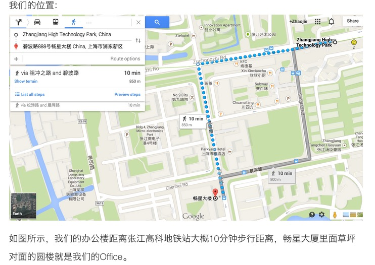

# SHLUG 2015年6月 月度技术分享会
--------------------------------------------------------------------------------
大家好，6月28日SHLUG将会举办2015年的6月技术交流聚会。感谢**[Teambition](https://www.teambition.com)**为本次活动提供的场地赞助.

**地址:** [浦东新区碧波路888号畅星大厦2幢2层](http://j.map.baidu.com/Lt5B3) (地铁2号线张江高科地铁站,出站后地图请见最下方图片)

**时间:** 2015年6月28日(星期日) 13:30 - 17:00

**报名:** 不需要

**费用:** 不需要

本月聚会内容:
---------------
1. 主题:**《运维安全与案例分享》** 演讲者:**陈天乐**

2. 自由交流

3. 会后AA聚餐

我们热烈欢迎任何对于Linux以及开源技术感兴趣的朋友前来参加!

# 主题详细信息:

## 主题1
《运维安全与案例分享》

### 演讲者
**陈天乐（http://brucectl.iteye.com）**

资深系统工程师、MySQL资深顾问、MCSE，RHCE，CMDBA

近8年大型跨国公司、近20年专业的互联网公司工作经验。曾任职于LYCOS中国大中华区运维总监，LIVEDOOR上海分公司运维总监等职务。在大型互联网系统以及传统的数据库系统方面有大量研究和实践经验。精通LINUX集群，WINDOWS集群等大型系统的架构设计，安全加固，对Linux-windows混合的操作系统环境运维有独到的研究。对MySQL有深入了解，精通MySQL的性能优化，备份恢复，日常维护以及扩展架构。

### 演讲内容
这两年，互联网上纷纷爆出BASH漏洞、OPENSSL漏洞、幽灵漏洞、OPENSSH漏洞等等，面对如此众多已知的和未知的惊天大漏洞，我们该如何从运维技术角度做好安全加固工作，避免中枪和遭殃呢！

### 需要的基础知识
有一些互联网技术基础，或者对于互联网运维感兴趣者。

### 预计时长
120-150分钟

